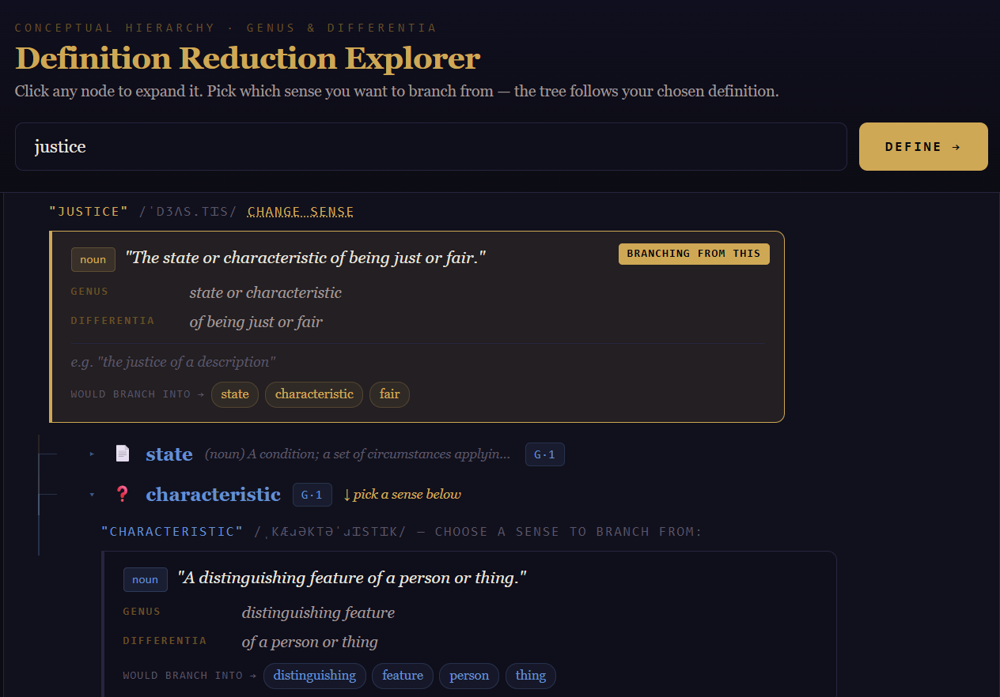

# Definition Reduction Explorer

An interactive dictionary tree that lets you drill into the meaning of any concept by recursively expanding its definitions — revealing the conceptual hierarchy beneath every word.



## What it does

1. **Enter any concept** — it fetches all dictionary definitions from [Wiktionary](https://dictionaryapi.dev) via free API
2. **Pick a sense** — every definition is shown with its parsed **Genus** (category) and **Differentia** (distinguishing feature), plus example sentences
3. **Branch** — the key terms from your chosen sense become child nodes you can expand further
4. **Repeat infinitely** — each child node can be expanded the same way, building a full definition tree as deep as you want

## Stack

- [React](https://react.dev) + [Vite](https://vitejs.dev)
- [Free Dictionary API](https://dictionaryapi.dev) (Wiktionary data, no API key needed)
- Zero dependencies beyond React itself

## Getting started

```bash
git clone https://github.com/fmue/definition-reduction-explorer
cd definition-reduction-explorer
npm install
npm run dev
```

Then open [http://localhost:5173](http://localhost:5173).

## Deploy to Netlify (one click)

[](https://app.netlify.com/start/deploy?repository=https://github.com/fmue/definition-reduction-explorer)

Or manually:

```bash
npm run build
# then drag the dist/ folder to netlify.com/drop
```

## Deploy to Vercel

```bash
npm install -g vercel
vercel
```

## How the genus/differentia parsing works

Each dictionary definition is parsed using a heuristic that mirrors classical definition structure:

1. Strip leading adverbs and articles
2. Look for strong relational markers (*"that", "which", "characterized by"*, etc.) — split there
3. Fall back to the first preposition after the head noun phrase
4. Comma / semicolon splits as a last resort

Adverbs (words ending in `-ly`) are converted to their root adjective form before being used as child terms — e.g. *"reciprocally"* → *"reciprocal"*.

## License

MIT
